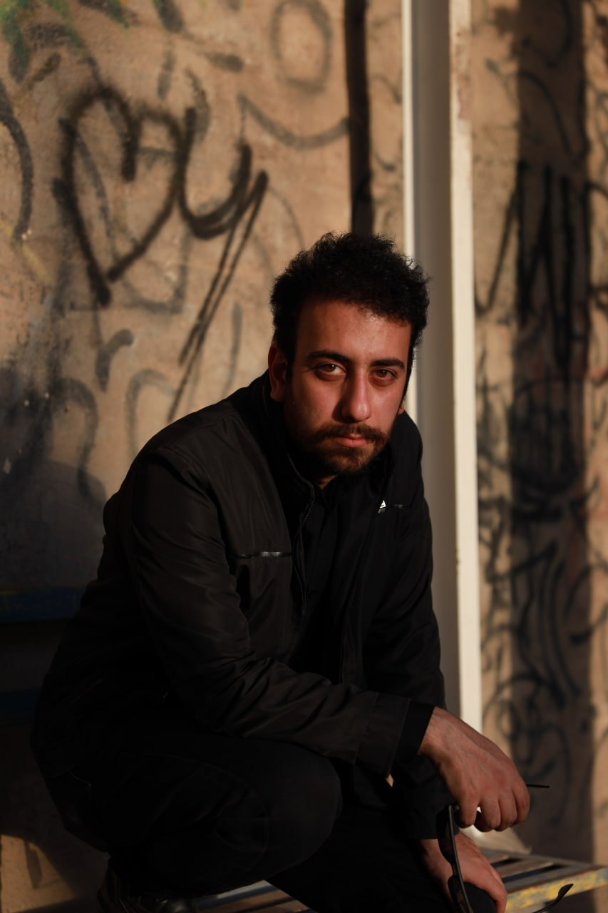
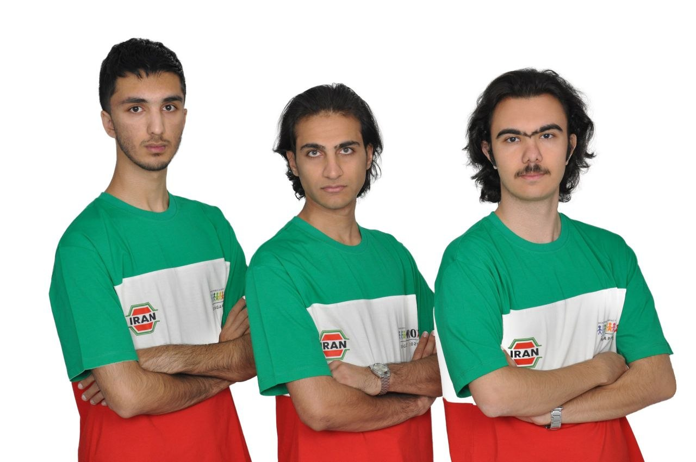
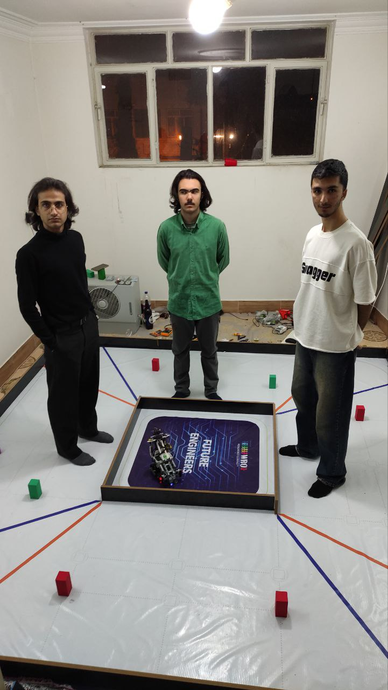
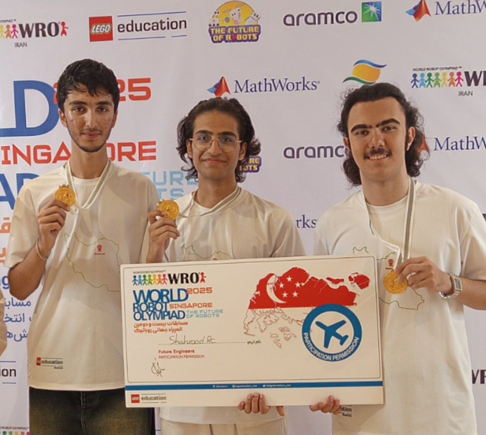
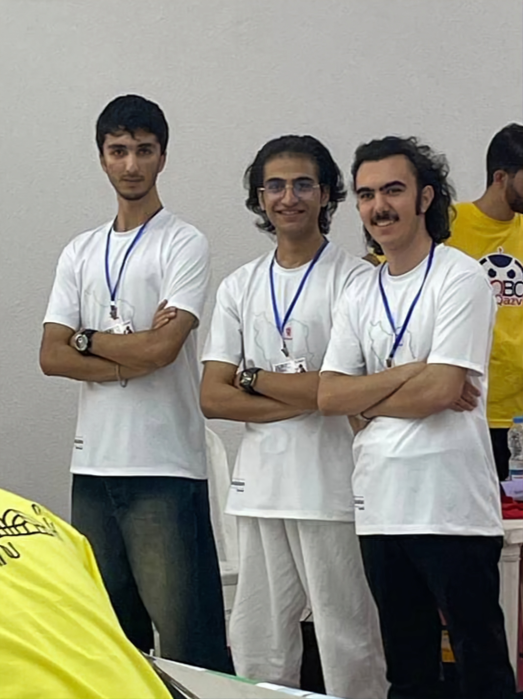
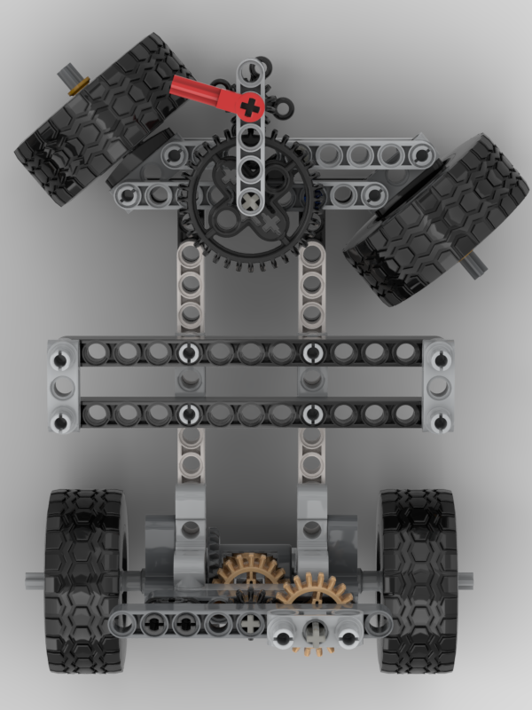
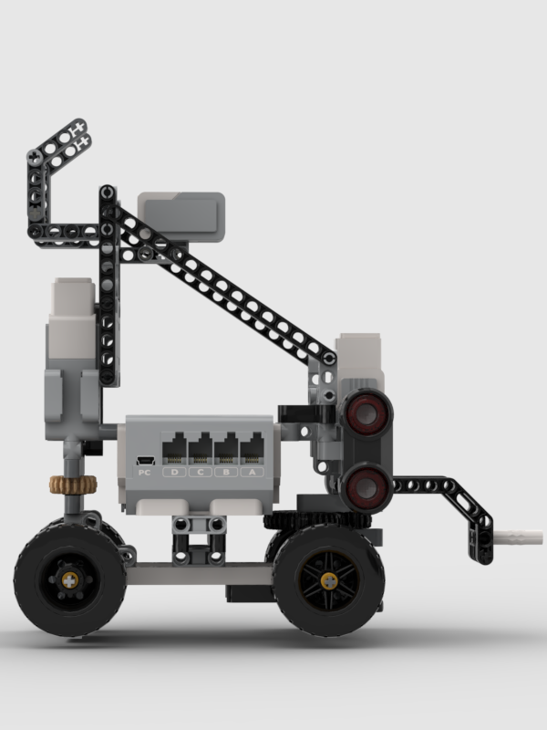

<!------------------------------------------------------------------->
<!--                     ShahroodRC – WRO 2026                     -->
<!------------------------------------------------------------------->

**ShahroodRC** – *Future Engineers 2026*  
🏆 **1st Place – Iran National WRO 2025**  
🌍 **Heading to Isfahan National Final (26-28 Nov 2025)**  
A fully autonomous LEGO EV3 robot with vision-based obstacle avoidance and precision navigation.

**📱 Connect with us:**

---

## 🎯 Key Features
| Feature | Details |
|---------|---------|
| 🤖 **Platform** | LEGO EV3 Mindstorms with Python (ev3dev) |
| 👁️ **Vision System** | Pixy 2.1 camera (60 fps, real-time obstacle detection) |
| 🧭 **Navigation** | Dual ultrasonic sensors + color sensor for precision wall-following |
| ⚡ **Performance** | 90% success rate in 50+ test runs; completes challenges in <2min |
| 🔧 **Custom Parts** | 3D-printed Pixy 2.1 mount for optimal positioning |
| 📦 **Components** | All standard LEGO pieces (100% WRO-compliant) |

---

## The Meaning Behind ShahroodRC

ShahroodRC blends "Shahrood" (our hometown in Iran, symbolizing resilience like its mountains) with "RC" (Robotics Club). Inspired by the story of iteration, teamwork, and turning "what if" into "we did it." Behind the code and gears? The quiet support of families – our real "power source," fueling late nights and breakthroughs. ShahroodRC isn't just a robot; it's proof that passion and persistence lead to a global stage.

---

## Table of Contents

- [👥 The Team](#-the-team)
- [🏆 National Championship Victory](#-national-championship-victory)
- [🎯 Mission Overview for WRO Future Engineers Rounds](#-mission-overview-for-wro-future-engineers-rounds)
- [📸 Pictures](#-pictures)
- [🎬 Videos](#-videos)
- [📱 Randomizer App](#-randomizer-app)
- [🔄 Our Path – Platform Evolution](#-our-path--platform-evolution)
- [🔄 Design Evolution & Iteration History](#-design-evolution--iteration-history)
- [📊 Performance Metrics & Statistics](#-performance-metrics--statistics)
- [🤖 Robot Components Overview](#-robot-components-overview)
- [💻 Code For Each Component](#-code-for-each-component)
    - [🔄 Drive Motor Code](#-drive-motor-code)
    - [🎯 Steering Motor Code](#-steering-motor-code)
    - [📷 Pixy Camera Code](#-pixy-camera-code)
    - [🌈 Color Sensor Code](#-color-sensor-code)
    - [💡 LED Indicator Code](#-led-indicator-code)
    - [📏 Ultrasonic Sensor Code](#-ultrasonic-sensor-code)
    - [🔘 Button Control Code](#-button-control-code)
    - [⚡ Main Control Flow](#-main-control-flow)
- [🚗 Mobility Management](#-mobility-management)
    - [1. 📍 Introduction to Mobility System](#1--introduction-to-mobility-system)
    - [2. ⚙️ Motors and Actuators](#2-️-motors-and-actuators)
    - [3. 📡 Sensor Integration for Mobility](#3--sensor-integration-for-mobility)
    - [4. 🎮 Mobility Control Algorithms](#4--mobility-control-algorithms)
    - [5. ⚡ Energy Management for Mobility](#5--energy-management-for-mobility)
    - [6. 🔗 System Integration for Mobility](#6--system-integration-for-mobility)
    - [7. 🧪 Testing and Optimization](#7--testing-and-optimization)
    - [8. ✅ Conclusion](#8--conclusion)
- [⚡ Power and Sense Management](#-power-and-sense-management)
    - [1. 🔋 Power Supply and Distribution](#1--power-supply-and-distribution)
    - [2. 📊 Power Consumption Overview](#2--power-consumption-overview)
    - [3. 📡 Sensor Architecture and Management](#3--sensor-architecture-and-management)
    - [4. 🔗 Wiring and Safety](#4--wiring-and-safety)
    - [5. 🔍 Diagnostics and Monitoring](#5--diagnostics-and-monitoring)
    - [6. ⚙️ Optimization Techniques](#6-️-optimization-techniques)
    - [7. ✅ Conclusion](#7--conclusion)
- [🚧 Obstacle Management](#-obstacle-management)
    - [🏁 Qualification Round (Open Challenge)](#-qualification-round-open-challenge)
    - [🏆 Final Round with Obstacle Avoidance (Obstacle Challenge)](#-final-round-with-obstacle-avoidance-obstacle-challenge)
- [🏗️ Robot Assembly Guide](#️-robot-assembly-guide)
- [🧠 Software Architecture & Obstacle Strategy](#-software-architecture--obstacle-strategy)
- [🧠 Systems Thinking & Engineering Decisions](#-systems-thinking--engineering-decisions)
- [🛠️ Software Setup & Installation](#️-software-setup--installation)
- [🔧 Sensor Calibration Guide](#-sensor-calibration-guide)
- [🔴 Problems and Solutions](#-problems-and-solutions)
- [💰 Cost Report](#-cost-report)
- [📁 Repository Structure](#-repository-structure)
- [🤝 Contributing & Support](#-contributing--support)
- [📖 License](#-license)

---

## 👥 The Team

We are the ShahroodRC team, a group of dedicated students from Iran with a passion for robotics, electronics, and programming. Our goal is to design an innovative robot for the WRO 2026 Future Engineers category, leveraging technical skills and collaboration to tackle complex challenges.

### 👨‍💼 Sepehr Yavarzadeh
- **Role**: Project Manager and Software Engineer
- **Age**: 17
- **Description**: Third-time WRO participant, 3rd place in 2025 Robo Mission. Passionate about programming, physics, and math. Enjoys piano and tennis.
- **Contact**: sepehryavarzadeh@gmail.com
- **Links**: [GitHub](https://github.com/Sepehryy) | [Instagram](https://www.instagram.com/sepehr.yavarzadeh/) | [LinkedIn](https://www.linkedin.com/in/sepehr-yavarzadeh-9643252a3/)

### 👨🏼‍🔧 Nikan Bashiri
- **Role**: Mechanical and Electronics Specialist
- **Age**: 18
- **Description**: Advanced LEGO robotics instructor with 5 WRO national finals experience. Expertise in mechanical/electronic systems and LEGO design.
- **Contact**: nikanbsr@gmail.com
- **Links**: [Instagram](https://www.instagram.com/nikanbsr/)

### 🧑‍💻 Amirparsa Saemi
- **Role**: Lead Developer and Algorithm Designer
- **Age**: 20
- **Description**: Third-year WRO competitor, professional ping-pong player. Studying computer science, passionate about math, physics, and programming.
- **Contact**: amirparsa.saemi2021@gmail.com
- **Links**: [Instagram](https://www.instagram.com/hotaru_tempest/)

### 👨🏻‍🏫 Ali Raeesian
- **Role**: Coach
- **Age**: 25
- **Description**: B.Sc. in Computer Engineering, pursuing M.Sc. in Computer Science. Former WRO competitor (2016 global finals). Specializes in game development.
- **Contact**: raeesianali@gmail.com
- **Links**: [GitHub](https://github.com/SheykhAlii) | [Instagram](https://www.instagram.com/ali_raeesiian/)

### 👨🏻‍🏫 Hossein Bagheri
- **Role**: Manager
- **Age**: 51
- **Description**: Founder of Shahrood's educational LEGO institute.
- **Links**: [Instagram](https://www.instagram.com/ho.bagheri/)

### Team Photos
| Sepehr Yavarzadeh | Nikan Bashiri | Amirparsa Saemi | Ali Raeesian | Hossein Bagheri |
|-------------------|---------------|-----------------|--------------|-----------------|
|  |  |  |  |  |

<table>
<tr>
<td align="center">
 

The ShahroodRC Team

</td>
<td align="center">
 

Fun Team Moments 🎉

</td>
</tr>
</table>

> In this project, we aimed to combine creativity, teamwork, and technical knowledge to build an efficient robot for the challenges of WRO 2026.

---

## 🏆 National Championship Victory & International Success

### 2025 National Championship
ShahroodRC secured **1st Place** at the Iran National WRO 2025 Competition (August 2025, Rasht), earning qualification for the WRO 2025 International Final.

### 2025 International Final – Singapore
Competing in the World Robot Olympiad 2025 (November 26–28, Singapore), ShahroodRC achieved:
- ✅ **Full Score** in Open Challenge
- ✅ **Full Score** in Obstacle Challenge
- 🌍 **12th Place Globally**

### 2026 National Qualifiers
Currently preparing for the **Iran National WRO 2026 Qualifying Round** (July 2026, Tehran) to qualify for WRO 2026 International Final.

### Gallery

<table>
<tr>
<td align="center" width="200">
 

<strong>National Championship Gold Medal</strong> 2025, Rasht

</td>
<td align="center" width="200">
 

<strong>International Final</strong> 2025, Singapore

</td>
</tr>
</table>

---

## Mobility & Mechanical Design

### Drive and Steering System Choices
- We provide propulsion with one LEGO EV3 Medium Motor driving the rear axle through a differential-style power train that turns both rear wheels together; we chose this because it concentrates traction control on a single actuator and keeps the drivetrain simple for repeatable motion.
- We handle steering with a second LEGO EV3 Medium Motor operating a rudder-style front axle mechanism that turns the front wheels left and right; we selected this arrangement because it cleanly separates steering from propulsion, making motion planning and recovery simpler.
- We selected this drive/steering layout because it separates traction from steering control, simplifying motion planning and reducing the number of active failure modes.
- We avoided a skid-steer layout because it introduces unpredictable pivot behavior and wheel slip; similarly, we did not use independent drive motors because they require more complex control logic, and instead chose this design to maintain consistent, repeatable handling.

### Mechanical Structure
- The chassis combines official LEGO EV3 structural elements with custom 3D-printed parts to create a rigid, lightweight frame.
- A reinforced rear axle and a low-mounted drive train keep the center of gravity low, improving stability in straight-line motion and during cornering.
- The front axle and steering linkages are braced to minimize flex and maintain predictable steering geometry under load.
- Cable routing is designed to stay clear of moving parts, bundled along the frame, and secured to reduce vibration and accidental interference.

### Mounting
- We used custom printed mounts to firmly position the Pixy 2.1 camera, gyro, and ultrasonic sensors so the sensing vectors remain stable under motion and do not shift during competition runs.
- We mounted the gyro centrally on top of the robot to minimize measurement error from pitching or rolling, because placing it near the center reduces the effect of rotational offsets on yaw readings.
- We mounted the two ultrasonic sensors at the front-left and front-right with a 90° orientation to the centerline to provide reliable side distance sensing; we chose this placement because it yields smoother side-range readings for wall-following.
- We elevated and angled the Pixy camera downward toward the field to ensure consistent target detection and line/object recognition, since that viewpoint improves signature size and reduces false positives.

### Torque and Speed Reasoning
- Each EV3 Medium Motor delivers 8 N·cm nominal torque and 12 N·cm stall torque, with a top speed of 240–250 rpm.
- We selected these motors because they provide a strong balance between power and precision, enabling controlled acceleration while preserving the accuracy needed for line following and obstacle approach.
- We tuned the drive train for moderate speed with high controllability rather than maximum velocity because that improves performance for precise navigation tasks.
- We geared the steering motor for smooth, repeatable wheel angles to enable accurate turns and stable lane corrections based on sensor feedback.
- We prioritized reproducible motion over raw acceleration to reduce mechanical stress and ensure repeatable performance across many runs.

### Design Justification
- We designed the robot for rigidity, precision, and reliability, choosing control and repeatability over raw speed.
- We added custom structural reinforcements and sensor mounts after testing revealed flex and alignment issues, because eliminating chassis flex directly improved sensor consistency and navigation accuracy.
- We validated the design with multiple test sessions: the robot completed more than 50 runs with consistent handling, showing over 90% success rate in repeated mobility and navigation trials.
- The result is a stable, robust system capable of accurate navigation and reproducible motion behavior for the Future Engineers challenge.

---

## ⚡ Power and Sense Management

### 1. 🔋 Power System Layout
- Primary power is supplied by the **EV3 battery pack** (LEGO EV3 rechargeable battery pack) rated at approximately **9V / 2050 mAh**.
- The EV3 battery pack is installed inside the EV3 brick and powers the brick itself, the two medium motors, the Pixy 2.1 camera, the gyro sensor, and both ultrasonic sensors.
- The EV3 brick distributes power to these components through its built-in ports; there is no separate custom power distribution harness for the main drive and sensing system.
- A separate **LED battery pack** is also mounted on the EV3 brick, but it is not part of the EV3 power bus. It is dedicated only to the front LED indicators and powers them through the relay switching circuit.
- Motor outputs are assigned as:
  - `OUTPUT_B` → Medium motor for rear drive
  - `OUTPUT_D` → Medium motor for front steering
  - `OUTPUT_A` → Relay coil for LED power switching
- Sensor inputs are assigned as:
  - `INPUT_1` → PixyCam 2.1
  - `INPUT_2` → Gyro sensor
  - `INPUT_3` → Ultrasonic sensor (right-side / front-right)
  - `INPUT_4` → Ultrasonic sensor (left-side / front-left)
- The EV3 port connection layout image shows exactly how Pixy, gyro, ultrasonics, motors, and relay connect to the EV3 brick.

### 2. 🔌 Wiring and Cabling
- All signal and power connections use **official LEGO EV3 cables**; no custom wiring harnesses are used.
- The Pixy 2.1 camera and sensors use dedicated EV3 sensor cables, while the motors and relay use EV3 output cables.
- Cables are routed cleanly along the frame, bundled away from moving parts, and secured to minimize vibration and accidental snags.
- Sensor cables are kept short enough to remain stable but long enough to allow proper positioning of the PixyCam, ultrasonic sensors, and gyro.
- Relay wiring is routed separately from the primary motor harness and sensor cables to reduce electromagnetic noise and physical interference.
- The front LEDs are powered by the separate **LED battery pack**, and their current flows through the relay contacts.
- The relay coil is driven by `OUTPUT_A` on the EV3 brick, so the EV3 can switch the LED supply on or off without carrying the LED current itself.
- The LED battery pack is otherwise isolated from the EV3 power bus; only the relay control signal is connected to the EV3.
- The battery pack remains accessible for quick inspection, swap-out, and power checks before each test run.

### 3. ⚡ Current Strategy
- The **2050 mAh EV3 battery pack** supports the combined load of two medium motors, three sensors, and the PixyCam with a comfortable margin.
- The separate **LED battery pack** powers only the front LED indicators and keeps LED load off the main EV3 power bus.
- The front LEDs are switched by a relay whose coil is controlled by `OUTPUT_A`; when `OUTPUT_A` is activated, the relay closes and allows the LED battery pack to feed the LEDs.
- When `OUTPUT_A` is deactivated, the relay opens and disconnects the LED battery pack from the LEDs, so the LEDs turn off.
- Front LEDs draw approximately **30 mA** when active; relay actuation adds only a small control load from `OUTPUT_A`.
- This design keeps the LED power path separate from the EV3 brick while still allowing software control of the LEDs through the EV3.
- The robot's control strategy emphasizes **moderate motor power** and **controlled acceleration** rather than maximum current draw.
- Motors are often issued coasting stop commands when not actively driving, which reduces stress on the battery and helps prevent current spikes.
- The sensor and vision system current loads are small compared to the motors, but they are included in the overall power budget to ensure stable voltage across the EV3 brick.
- Because the EV3 battery pack is centered on the robot, the weight is distributed evenly across the wheels and does not create handling problems during long runs.

### 4. 📡 Sensor Choices and Placement
- **Pixy 2.1 camera** is mounted above and slightly rearward on the robot, angled about **35° downward toward the field**. We chose this location so the Pixy can see the path ahead without having its view blocked by the robot body.
- The downward tilt keeps the Pixy focused on the field and avoids looking at objects outside the arena, which reduces false detections.
- **Gyro sensor** is mounted centrally on top of the robot. We placed it here for two reasons:
  - It is kept away from strong electromagnetic sources like the battery pack, camera, and LEDs.
  - It is nearer the robot's rotation center, so the heading output is more stable and easier to use for closed-loop control.
- **Ultrasonic sensors** are mounted at the front-left and front-right, each oriented roughly **perpendicular to the robot centerline**. We positioned them slightly ahead of the robot center so they can see the walls in advance and accurately estimate the robot's distance to the field boundaries.
- We use two ultrasonic sensors because the robot must handle both turning directions around the field walls. The right sensor is used during clockwise motion, and the left sensor is used during counter-clockwise motion.
- These sensors also compare left/right distances at the beginning of the Obstacle Challenge to determine whether the robot will turn clockwise or counter-clockwise around the arena.
- In the Open Challenge, the same left/right comparison in the first section helps detect which wall segment is the central 1-meter wall and choose the correct turning direction.
- **Front LED indicators** are mounted above the EV3 brick near the center and facing forward. This location provides the most effective illumination of the path and obstacles.
- The LEDs are angled slightly outward to light the side edges of the robot and the obstacles, ensuring the Pixy camera keeps the object visible until the last moment during obstacle passage.
- The **EV3 battery pack** is installed inside the EV3 brick near the robot center, minimizing its effect on the center of gravity and keeping the weight distribution even across the wheels.
- The separate **LED battery pack** is mounted on top of the EV3 brick near the center so its mass is balanced and its power source stays dedicated to the LEDs.

### 5. 🧪 Calibration and Verification
- **Gyro calibration** is performed before each competition run; the robot is held still while the gyro is zeroed to reduce drift.
- **Ultrasonic calibration** is done by checking each sensor against a fixed reference distance and using averaged readings to remove noise.
- **Relay and LED verification** is included in the pre-run checklist: confirm that `OUTPUT_A` correctly triggers the relay and that the front LEDs switch on and off as expected.
- **PixyCam verification** includes cleaning the lens, checking object signatures with PixyMon, and confirming detection reliability under competition lighting.
- Regular inspection of connector seating, cable strain relief, and sensor alignment is part of the pre-run checklist.

### 6. 🗺️ Diagrams and Reference
- The full power distribution and sensor port layout is documented in `pictures\electrical-diagram\ev3-port-connection-layout.png`.
- This diagram shows the EV3 battery pack, intelligent brick, relay path for the front LEDs, and sensor port assignments.
- Keep the diagram available during assembly, debugging, and competition setup to verify port mapping and wiring.
- The EV3 port connection layout image provides a visual reference for how camera, gyro, ultrasonics, motors, and relay connect to the EV3 ports.

---

## 🧠 Software Architecture & Obstacle Strategy

### A. Code Structure and Modules
- The software runs on **EV3Dev2 Python** using two main scripts: `code/open_challenge.py` for the open-course run and `code/obstacle_challenge.py` for the obstacle course.
- Each script follows a layered structure:
  - hardware initialization and port assignment
  - perception and sensor processing
  - motion control and steering commands
  - behavior state management and progression through course segments
- Reusable helper functions include `clamp()` for safe output limiting and `amotor()` for converting target steering into a controlled medium-motor command.
- The code uses distinct logical modules rather than separate Python packages: motor control, ultrasonic wall sensing, Pixy vision, search fallback behavior, and route progression.

### B. State Machines and Execution Flow
- The robot begins in a **startup state**: all sensors are initialized, LEDs indicate readiness, and the run begins after the EV3 button press.
- Both scripts use explicit loop variables and counters as state managers:
  - `g`, `a`, `door` and `jahat` in `obstacle_challenge.py`
  - `sig`, `lastsig`, `Yignor`, `a`, `fasele`, and `ghabeliat` in `open_challenge.py`
- Key runtime states include:
  - **direction selection**: compare left/right ultrasonic distances to decide the initial approach side
  - **visual target search**: attempt to detect signatures with the Pixy camera and use `sig` values to classify objects
  - **tracking mode**: steer toward a detected target when a valid Pixy signature appears
  - **fallback wall/line following**: when vision fails, use ultrasonic sensors to maintain a lane or wall reference
  - **segment progression**: advance counters and break loops when the current course section completes

### C. Lane Following and Path Control
- Lane following is implemented using **side ultrasonic sensing** with a target distance setpoint around **27–33 cm** from the wall.
- The control law is proportional: `out = (setpoint - measured_distance) * direction_sign`, then limited with `clamp()` to prevent oversteering.
- In `open_challenge.py`, the robot also uses Pixy X-coordinates to center itself on a detected target or line marker: `target = (x - center) * gain`, then `amotor(target)` to adjust steering.
- The `amotor()` helper limits steering output and smooths actuator response, providing stable motion while the robot moves forward continuously.

### D. Obstacle Logic and Vision Strategy
- The Pixy camera is set to `ALL` mode and the code reads signature values from `pixy.value()`, producing `sig==1` or `sig==2` for two target classes.
- A valid detection is gated with a minimum `y` value (`Yignor`) to ensure the object is large enough and close enough to trust.
- When a target is visible, the robot computes a steering correction from the Pixy horizontal position and drives toward the object at moderate speed.
- If vision is lost (`sig == 0`), the software enters a **search fallback**:
  - continue forward while slowly changing steering until a signature reappears
  - if necessary, hold a steady course briefly while continuously checking for new detections
- In `obstacle_challenge.py`, the code augments vision with wall-following behavior: when the target is absent, the robot uses the active side ultrasonic sensor and `fasele` to maintain a safe clearance along the wall.

### E. Algorithm Explanation
- Steering is governed by proportional control: the error between desired and actual values is multiplied by a gain, then clamped to a safe motor range.
- In `open_challenge.py`, `amotor()` scales the steering error with `0.7` and applies a maximum magnitude, which dampens oscillation and improves stability.
- In `obstacle_challenge.py`, initial wall control uses a non-linear transformation of the ultrasonic distance to compute a smooth steering command, making the robot more responsive when it gets closer to the wall.
- The overall strategy balances visual tracking with robust fallback behaviors, combining **vision-guided target alignment** and **ultrasonic-based lane following** so the robot can continue even when the path or object is temporarily lost.

---

## � Systems Thinking & Engineering Decisions

This section summarizes the main engineering decisions behind the robot design, the relationships between subsystems, and the reasoning used to make the system robust for the Future Engineers challenge.

### Subsystem Interactions
- The drive and steering subsystems are coupled through the EV3 control logic: the rear drive motor provides forward propulsion while the front steering motor changes the heading. The software converts steering targets into controlled actuator commands through a proportional controller with output limiting.
- The vision subsystem uses the Pixy 2.1 camera to detect task-relevant objects and estimate their horizontal position and size. These measurements influence steering direction and speed during target tracking.
- The proximity subsystem uses two ultrasonic sensors placed on the left and right sides of the robot to maintain a safe side clearance and to support fallback behavior when vision is temporarily lost.
- The gyro subsystem continuously provides yaw-angle feedback to the EV3 brick, allowing the robot to stabilize heading and correct drift during motion.
- The lighting subsystem uses front LEDs powered by a separate battery pack and controlled through a relay connected to OUTPUT_A. This improves visibility for the camera and makes detection more reliable in different lighting conditions.

### Constraints
- Mechanical constraints: robot dimensions are approximately 24 cm long, 14 cm wide, 27 cm high, with a 11.2 cm wheelbase and 8 cm track width on both front and rear axles.
- Hardware constraints: the system is built around two EV3 Medium Motors, the EV3 brick, and a limited battery capacity, so power draw and control aggressiveness must be balanced carefully.
- Sensor constraints: the Pixy camera is sensitive to lighting, the ultrasonic sensors are affected by reflections and geometry, and the gyro can drift if not calibrated properly.
- Competition constraints: the robot must comply with WRO Future Engineers rules, and the design must remain simple, robust, and reliable under repeated test runs.

### Trade-offs
- A rear-wheel drive with front-wheel steering was chosen because it offers predictable motion and simpler control compared with skid-steer or fully independent drive motors.
- The rudder-style steering layout improves repeatability and stable cornering, but it is less aggressive in tight turning than a skid-steer system.
- The robot prioritizes visual target tracking when the Pixy signal is strong, but it shifts to ultrasonic-based fallback behavior when the camera loses detection, which increases robustness.
- Custom 3D-printed mounts were used to improve sensor stability and alignment, which helps maintain consistent performance during testing and competition.
- The team chose moderate acceleration and controlled motion over maximum speed to reduce power sag, mechanical stress, and control instability.

### Iteration Cycles
- Version 1: the robot used a basic chassis with two ultrasonic sensors angled about 30° forward and the gyro placed at the front. The Pixy camera was mounted at the rear and elevated.
- Version 2: the ultrasonic sensors were reoriented to face directly left and right, improving side-distance sensing. The Pixy camera was also tilted slightly downward for better target visibility.
- Version 3: the gyro was moved to the center and top of the robot to reduce measurement error, and the LEDs were placed near the gyro for better illumination.
- Final adjustment: the LED angle was slightly changed so that the light spread improved toward the left and right sides of the robot.
- The software was also tuned experimentally through repeated test runs, with gains, thresholds, and control limits adjusted until motion became stable and repeatable.

### Risk Analysis
| Risk | Likelihood | Impact | Mitigation |
|------|------------|--------|------------|
| Pixy detection failure due to lighting or angle | Medium | High | LED illumination, threshold tuning, fallback search behavior |
| Ultrasonic false readings from reflections | Medium | Medium | Careful sensor positioning, filtering, and control clamping |
| Gyro drift or calibration error | Medium | High | Pre-run calibration and stable mounting near the robot center |
| Mechanical looseness or cable interference | Medium | High | Reinforced mounts, cable routing, and vibration-resistant assembly |
| Power drop during long or aggressive runs | Medium | Medium | Moderate motor power, controlled acceleration, and battery checks |
| Single-point failure in a critical subsystem | Medium | High | Spare parts, fallback logic, and simple recovery behavior |

### Engineering Reasoning
- The core design goal was reliability, repeatability, and precision rather than raw speed. This is why the robot uses a stable drive-steering layout, controlled motor commands, and a layered sensing strategy.
- The control logic uses proportional steering corrections with clamping to prevent overreaction and oscillation. The steering command is smoothed so that the robot can track targets without sudden jerks.
- The system is intentionally designed to be resilient: when vision is unavailable, the robot shifts to ultrasonic-guided navigation rather than stopping or failing completely.
- The mechanical and electrical layout was also chosen to support maintainability. The robot can be serviced quickly during testing and competition because sensors, motors, and wiring are organized logically and spare components are available.

### Spare Parts and Pre-Run Checklist
- Spare parts: two extra EV3 Medium Motors, extra ultrasonic sensors, extra gyro sensor, one extra Pixy camera, extra wheels and tires, spare EV3 battery, spare LED battery pack, relay, cables, connectors, and soldering tools.
- Pre-run checklist: confirm the EV3 battery is charged, verify the LED battery pack is charged, clean the Pixy lens, check sensor ports, calibrate the gyro while the robot is still, verify relay operation through OUTPUT_A, inspect cable routing and mounts, and perform a short dry run before the actual challenge.

---

## �🤝 Contributing & Support

This project is **open-source** and welcomes:
- 🐛 **Bug reports** – Found an issue? Let us know!
- 💡 **Suggestions** – Have ideas for improvement? Share them!
- 📚 **Documentation improvements** – Help make it clearer!

### Quick Links
- 📧 **Email**: sepehryavarzadeh@gmail.com (Project Manager)
- 🌐 **Instagram**: [@shahroodrc](https://instagram.com/shahroodrc)
- 📹 **YouTube**: [ShahroodRC Channel](https://youtube.com/@shahroodrc)

---

## 📖 License
This project is licensed under the **MIT License**, allowing free use, modification, and distribution with proper attribution. See the [LICENSE](LICENSE) file for full details.

---

**Built with ❤️ by ShahroodRC Team**

🚀 Representing Iran at WRO 2026 National Final in Tehran 🌍

See you in Tehran!

© 2026 ShahroodRC – All rights reserved.

