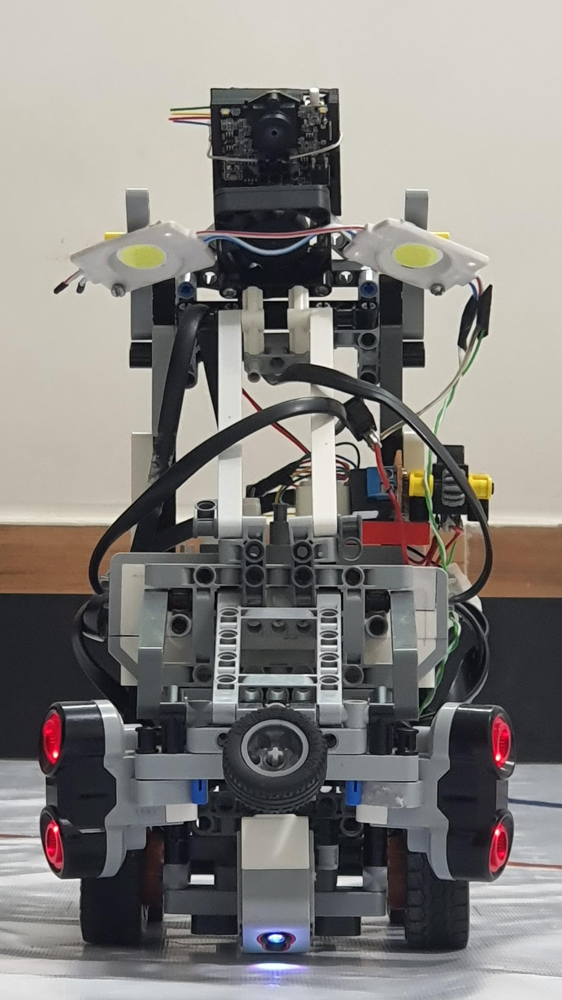
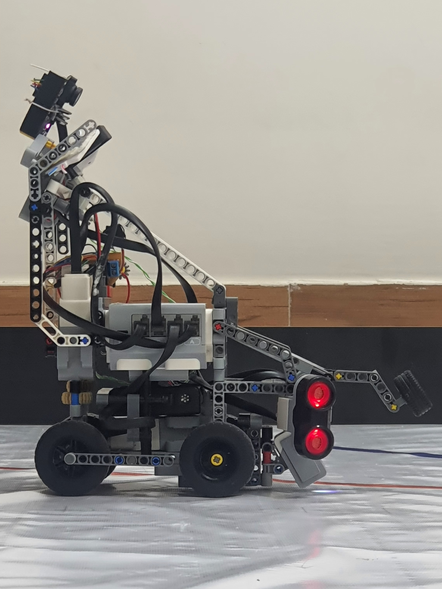
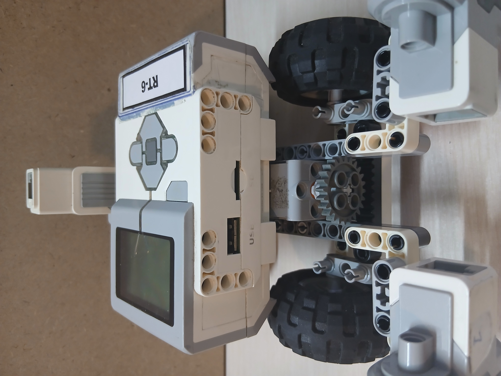
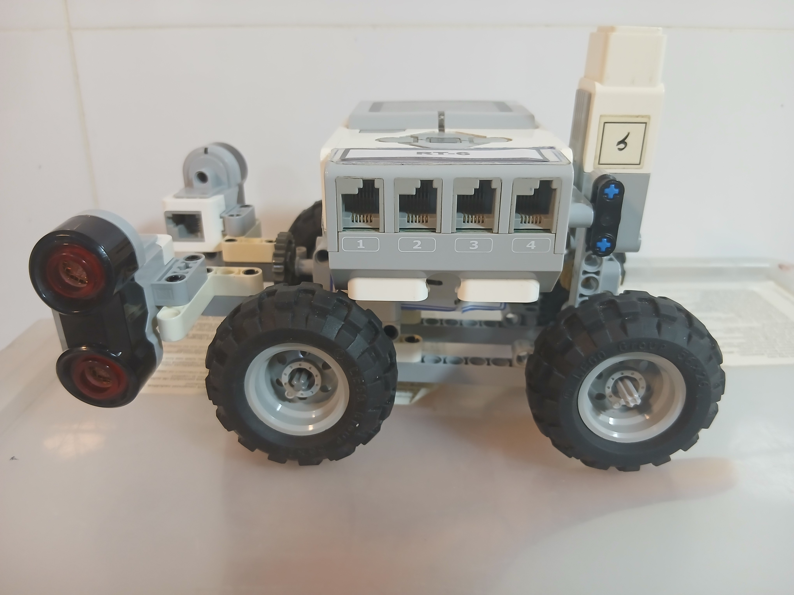
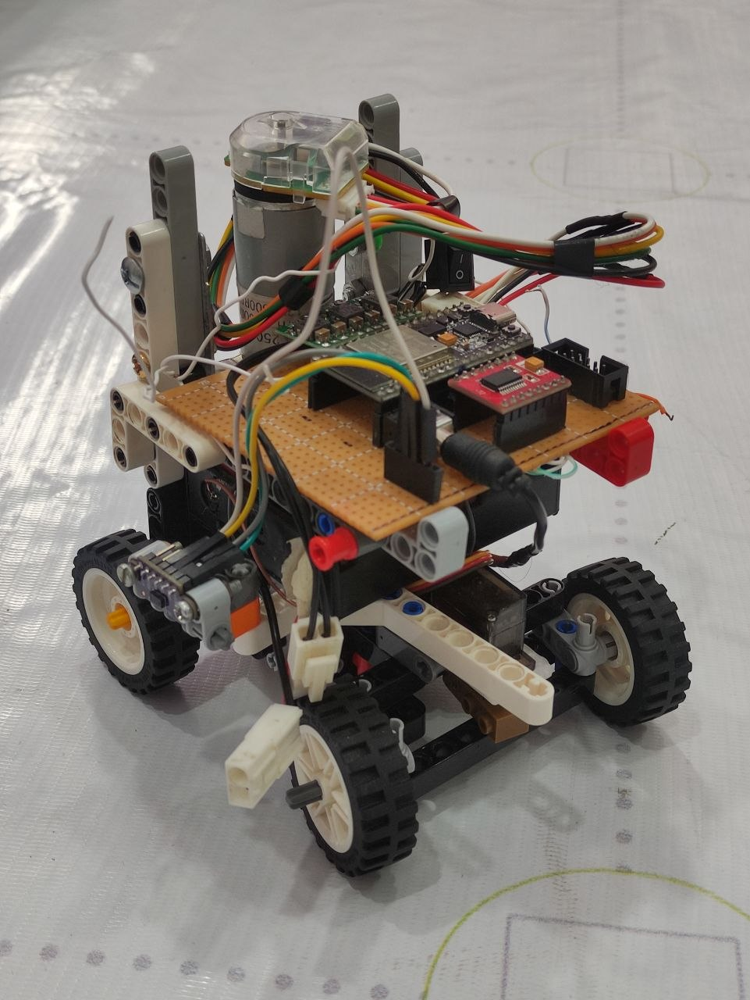
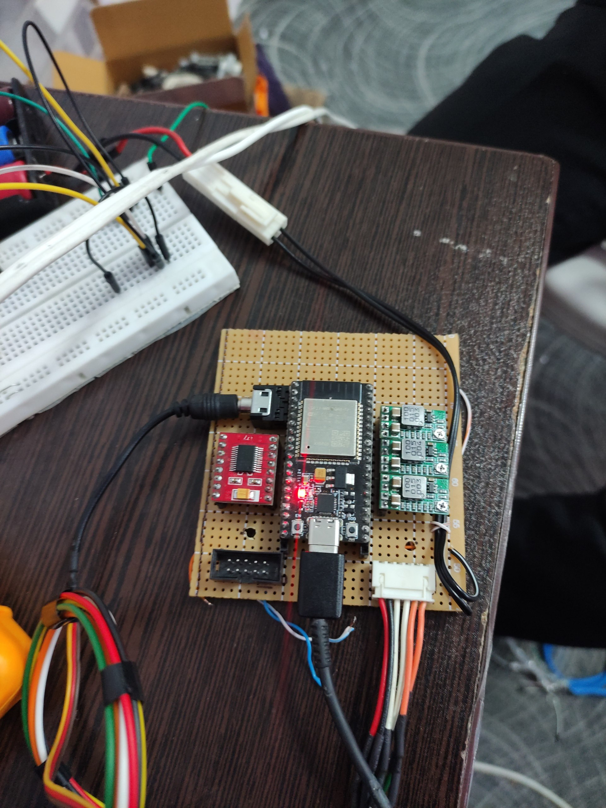
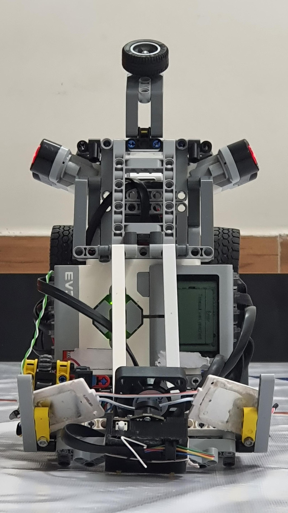
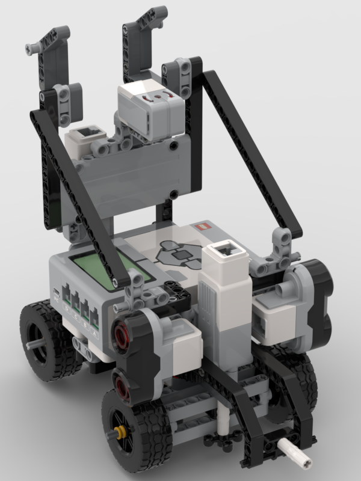
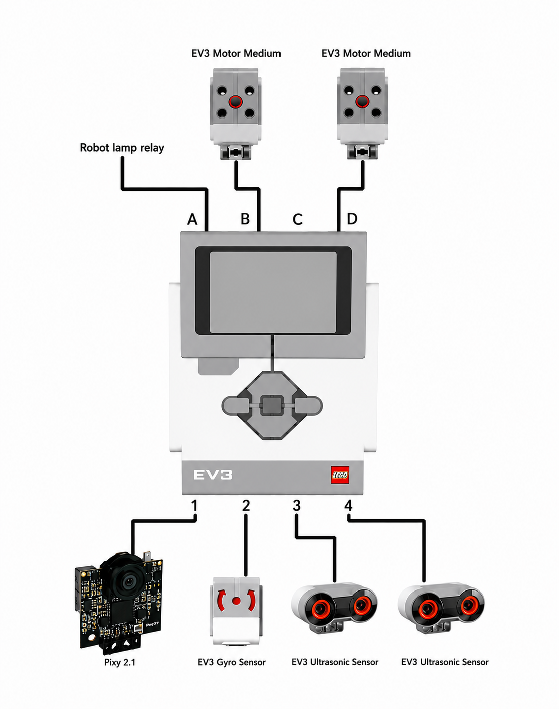

<!------------------------------------------------------------------->
<!--                     ShahroodRC – WRO 2026                     -->
<!------------------------------------------------------------------->

**ShahroodRC** – *Future Engineers 2026*  
🏆 **1st Place – Iran National WRO 2025**  
🌍 **Heading to Tehran National Final (26-28 Nov 2025)**  
A fully autonomous LEGO EV3 robot with vision-based obstacle avoidance and precision navigation.

**📱 Connect with us:**

---

## 🎯 Key Features
| Feature | Details |
|---------|---------|
| 🤖 **Platform** | LEGO EV3 Mindstorms with Python (ev3dev) |
| 👁️ **Vision System** | Pixy 2.1 camera (60 fps, real-time obstacle detection) |
| 🧭 **Navigation** | Dual ultrasonic sensors + color sensor for precision wall-following |
| ⚡ **Performance** | 90% success rate in 50+ test runs; completes challenges in <2min |
| 🔧 **Custom Parts** | 3D-printed Pixy 2.1 mount for optimal positioning |
| 📦 **Components** | All standard LEGO pieces (100% WRO-compliant) |

---

## The Meaning Behind ShahroodRC

ShahroodRC blends "Shahrood" (our hometown in Iran, symbolizing resilience like its mountains) with "RC" (Robotics Club). Inspired by the story of iteration, teamwork, and turning "what if" into "we did it." Behind the code and gears? The quiet support of families – our real "power source," fueling late nights and breakthroughs. ShahroodRC isn't just a robot; it's proof that passion and persistence lead to a global stage.

---

## Table of Contents

- [👥 The Team](#-the-team)
- [🏆 National Championship Victory](#-national-championship-victory)
- [🎯 Mission Overview for WRO Future Engineers Rounds](#-mission-overview-for-wro-future-engineers-rounds)
- [📸 Pictures](#-pictures)
- [🎬 Videos](#-videos)
- [📱 Randomizer App](#-randomizer-app)
- [🔄 Our Path – Platform Evolution](#-our-path--platform-evolution)
- [🔄 Design Evolution & Iteration History](#-design-evolution--iteration-history)
- [📊 Performance Metrics & Statistics](#-performance-metrics--statistics)
- [🤖 Robot Components Overview](#-robot-components-overview)
- [💻 Code For Each Component](#-code-for-each-component)
    - [🔄 Drive Motor Code](#-drive-motor-code)
    - [🎯 Steering Motor Code](#-steering-motor-code)
    - [📷 Pixy Camera Code](#-pixy-camera-code)
    - [🌈 Color Sensor Code](#-color-sensor-code)
    - [💡 LED Indicator Code](#-led-indicator-code)
    - [📏 Ultrasonic Sensor Code](#-ultrasonic-sensor-code)
    - [🔘 Button Control Code](#-button-control-code)
    - [⚡ Main Control Flow](#-main-control-flow)
- [🚗 Mobility Management](#-mobility-management)
    - [1. 📍 Introduction to Mobility System](#1--introduction-to-mobility-system)
    - [2. ⚙️ Motors and Actuators](#2-️-motors-and-actuators)
    - [3. 📡 Sensor Integration for Mobility](#3--sensor-integration-for-mobility)
    - [4. 🎮 Mobility Control Algorithms](#4--mobility-control-algorithms)
    - [5. ⚡ Energy Management for Mobility](#5--energy-management-for-mobility)
    - [6. 🔗 System Integration for Mobility](#6--system-integration-for-mobility)
    - [7. 🧪 Testing and Optimization](#7--testing-and-optimization)
    - [8. ✅ Conclusion](#8--conclusion)
- [⚡ Power and Sense Management](#-power-and-sense-management)
    - [1. 🔋 Power Supply and Distribution](#1--power-supply-and-distribution)
    - [2. 📊 Power Consumption Overview](#2--power-consumption-overview)
    - [3. 📡 Sensor Architecture and Management](#3--sensor-architecture-and-management)
    - [4. 🔗 Wiring and Safety](#4--wiring-and-safety)
    - [5. 🔍 Diagnostics and Monitoring](#5--diagnostics-and-monitoring)
    - [6. ⚙️ Optimization Techniques](#6-️-optimization-techniques)
    - [7. ✅ Conclusion](#7--conclusion)
- [🚧 Obstacle Management](#-obstacle-management)
    - [🏁 Qualification Round (Open Challenge)](#-qualification-round-open-challenge)
    - [🏆 Final Round with Obstacle Avoidance (Obstacle Challenge)](#-final-round-with-obstacle-avoidance-obstacle-challenge)
- [🏗️ Robot Assembly Guide](#️-robot-assembly-guide)
- [🧠 Software Architecture & Obstacle Strategy](#-software-architecture--obstacle-strategy)
- [🧠 Systems Thinking & Engineering Decisions](#-systems-thinking--engineering-decisions)
- [🛠️ Software Setup & Installation](#️-software-setup--installation)
- [🔧 Sensor Calibration Guide](#-sensor-calibration-guide)
- [🔴 Problems and Solutions](#-problems-and-solutions)
- [💰 Cost Report](#-cost-report)
- [📁 Repository Structure](#-repository-structure)
- [🤝 Contributing & Support](#-contributing--support)
- [📖 License](#-license)

---

## 👥 The Team

We are the ShahroodRC team, a group of dedicated students from Iran with a passion for robotics, electronics, and programming. Our goal is to design an innovative robot for the WRO 2026 Future Engineers category, leveraging technical skills and collaboration to tackle complex challenges.

### 👨‍💼 Sepehr Yavarzadeh
- **Role**: Project Manager and Software Engineer
- **Age**: 17
- **Description**: Third-time WRO participant, 3rd place in 2025 Robo Mission. Passionate about programming, physics, and math. Enjoys piano and tennis.
- **Contact**: sepehryavarzadeh@gmail.com
- **Links**: [GitHub](https://github.com/Sepehryy) | [Instagram](https://www.instagram.com/sepehr.yavarzadeh/) | [LinkedIn](https://www.linkedin.com/in/sepehr-yavarzadeh-9643252a3/)

### 👨🏼‍🔧 Nikan Bashiri
- **Role**: Mechanical and Electronics Specialist
- **Age**: 18
- **Description**: Advanced LEGO robotics instructor with 5 WRO national finals experience. Expertise in mechanical/electronic systems and LEGO design.
- **Contact**: nikanbsr@gmail.com
- **Links**: [Instagram](https://www.instagram.com/nikanbsr/)

### 🧑‍💻 Amirparsa Saemi
- **Role**: Lead Developer and Algorithm Designer
- **Age**: 20
- **Description**: Third-year WRO competitor, professional ping-pong player. Studying computer science, passionate about math, physics, and programming.
- **Contact**: amirparsa.saemi2021@gmail.com
- **Links**: [Instagram](https://www.instagram.com/hotaru_tempest/)

### 👨🏻‍🏫 Ali Raeesian
- **Role**: Coach
- **Age**: 25
- **Description**: B.Sc. in Computer Engineering, pursuing M.Sc. in Computer Science. Former WRO competitor (2016 global finals). Specializes in game development.
- **Contact**: raeesianali@gmail.com
- **Links**: [GitHub](https://github.com/SheykhAlii) | [Instagram](https://www.instagram.com/ali_raeesiian/)

### 👨🏻‍🏫 Hossein Bagheri
- **Role**: Manager
- **Age**: 51
- **Description**: Founder of Shahrood's educational LEGO institute.
- **Links**: [Instagram](https://www.instagram.com/ho.bagheri/)

### Team Photos
| Sepehr Yavarzadeh | Nikan Bashiri | Amirparsa Saemi | Ali Raeesian | Hossein Bagheri |
|-------------------|---------------|-----------------|--------------|-----------------|
|  |  |  |  |  |

<table>
<tr>
<td align="center">
 

The ShahroodRC Team

</td>
<td align="center">
 

Fun Team Moments 🎉

</td>
</tr>
</table>

> In this project, we aimed to combine creativity, teamwork, and technical knowledge to build an efficient robot for the challenges of WRO 2026.

---

## 🏆 National Championship Victory & International Success

### 2025 National Championship
ShahroodRC secured **1st Place** at the Iran National WRO 2025 Competition (August 2025, Rasht), earning qualification for the WRO 2025 International Final.

### 2025 International Final – Singapore
Competing in the World Robot Olympiad 2025 (November 26–28, Singapore), ShahroodRC achieved:
- ✅ **Full Score** in Open Challenge
- ✅ **Full Score** in Obstacle Challenge
- 🌍 **12th Place Globally**

### 2026 National Qualifiers
Currently preparing for the **Iran National WRO 2026 Qualifying Round** (July 2026, Tehran) to qualify for WRO 2026 International Final.

### Gallery

<table>
<tr>
<td align="center" width="200">
 

<strong>National Championship Gold Medal</strong> 2025, Rasht

</td>
<td align="center" width="200">
 

<strong>International Final</strong> 2025, Singapore

</td>
</tr>
</table>

---

## Robot Progress Journey

A reason-driven timeline of the robot's development through four design stages. Each version reflects a clear decision: what we learned, what we improved, and why the next stage was needed.

### Version 1 – EV3 starter prototype

This first prototype used the EV3 platform with:
- two ultrasonic sensors for distance awareness
- a floor-mounted color sensor for lap counting
- a Pixy 1 camera for early vision experiments
- two drive motors for propulsion in the Open Challenge, and a single drive motor in the Obstacle Challenge to reduce complexity under difficult conditions

Why this design? The goal was to get a working system on the field quickly and use the color sensor as a simple, reliable lap counter. The limitations were also clear: the robot was slow, the Pixy 1 vision was inconsistent on obstacles, and the system relied too much on floor color detection rather than robust obstacle awareness.

### Version 2 – sensor upgrade and chassis exploration

In the second version we focused on improving sensing and motion control:
- removed the floor color sensor entirely
- added a gyro sensor for heading stability
- upgraded from Pixy 1 to Pixy 2.1 for better obstacle recognition
- tested a new chassis layout with different wheelbase and track dimensions

Why this design? We needed more reliable perception and better heading control. The Pixy 2.1 and gyro were stronger choices, but the chassis geometry still needed refinement: the front-to-rear spacing was too large and the left-right track too narrow, which prevented the robot from moving as accurately as required.

### Electronic Prototype – parallel non-EV3 path

While building Version 3, we also began a separate electronic robot project to overcome EV3 hardware limits:
- non-EV3 electronics to escape EV3 processing speed and sensor flexibility constraints
- a design aimed at higher speed and smaller physical size
- Open Challenge functionality completed, with obstacle detection in progress

Why this path? We recognized that EV3 imposed hard limits on processing speed, sensor variety, and overall agility. The electronic prototype is intended for future competition use, but it is still under development and not yet ready for the Obstacle Challenge.

### Version 3 – competition-ready EV3 robot

The final version is the most refined and reliable EV3 robot we produced:
- sensor placement was optimized for gyro, Pixy 2.1, and ultrasonic sensing
- left-right track width and front-rear wheelbase were corrected for repeatable handling
- the robot achieved smooth, repeatable motion and met the competition requirements

Why this version? It represents the design that learned from the earlier prototypes: better vision, better heading control, and a corrected chassis layout. This is the version we brought to competition-ready performance.

## Mobility & Mechanical Design

### Drive and Steering System Choices
- We provide propulsion with one LEGO EV3 Medium Motor driving the rear axle through a differential-style power train that turns both rear wheels together; we chose this because it concentrates traction control on a single actuator and keeps the drivetrain simple for repeatable motion.
- We handle steering with a second LEGO EV3 Medium Motor operating a rudder-style front axle mechanism that turns the front wheels left and right; we selected this arrangement because it cleanly separates steering from propulsion, making motion planning and recovery simpler.
- We selected this drive/steering layout because it separates traction from steering control, simplifying motion planning and reducing the number of active failure modes.
- We avoided a skid-steer layout because it introduces unpredictable pivot behavior and wheel slip; similarly, we did not use independent drive motors because they require more complex control logic, and instead chose this design to maintain consistent, repeatable handling.

### Mechanical Structure
- The chassis combines official LEGO EV3 structural elements with custom 3D-printed parts to create a rigid, lightweight frame.
- A reinforced rear axle and a low-mounted drive train keep the center of gravity low, improving stability in straight-line motion and during cornering.
- The front axle and steering linkages are braced to minimize flex and maintain predictable steering geometry under load.
- Cable routing is designed to stay clear of moving parts, bundled along the frame, and secured to reduce vibration and accidental interference.

### Mounting
- We used custom printed mounts to firmly position the Pixy 2.1 camera, gyro, and ultrasonic sensors so the sensing vectors remain stable under motion and do not shift during competition runs.
- We mounted the gyro centrally on top of the robot to minimize measurement error from pitching or rolling, because placing it near the center reduces the effect of rotational offsets on yaw readings.
- We mounted the two ultrasonic sensors at the front-left and front-right with a 90° orientation to the centerline to provide reliable side distance sensing; we chose this placement because it yields smoother side-range readings for wall-following.
- We elevated and angled the Pixy camera downward toward the field to ensure consistent target detection and line/object recognition, since that viewpoint improves signature size and reduces false positives.

### Torque and Speed Reasoning
- Each EV3 Medium Motor delivers 8 N·cm nominal torque and 12 N·cm stall torque, with a top speed of 240–250 rpm.
- We selected these motors because they provide a strong balance between power and precision, enabling controlled acceleration while preserving the accuracy needed for line following and obstacle approach.
- We tuned the drive train for moderate speed with high controllability rather than maximum velocity because that improves performance for precise navigation tasks.
- We geared the steering motor for smooth, repeatable wheel angles to enable accurate turns and stable lane corrections based on sensor feedback.
- We prioritized reproducible motion over raw acceleration to reduce mechanical stress and ensure repeatable performance across many runs.

### Design Justification
- We designed the robot for rigidity, precision, and reliability, choosing control and repeatability over raw speed.
- We added custom structural reinforcements and sensor mounts after testing revealed flex and alignment issues, because eliminating chassis flex directly improved sensor consistency and navigation accuracy.
- We validated the design with multiple test sessions: the robot completed more than 50 runs with consistent handling, showing over 90% success rate in repeated mobility and navigation trials.
- The result is a stable, robust system capable of accurate navigation and reproducible motion behavior for the Future Engineers challenge.

---

## ⚡ Power and Sense Management

### 1. 🔋 Power System Layout
- Primary power is supplied by the **EV3 battery pack** (LEGO EV3 rechargeable battery pack) rated at approximately **9V / 2050 mAh**.
- The EV3 battery pack is installed inside the EV3 brick and powers the EV3 brick itself, the two medium motors, the gyro sensor, both ultrasonic sensors, and the Pixy 2.1 camera.
- The EV3 brick is the central power distribution hub. Unlike Arduino/ESP32/Raspberry Pi systems that often require a separate custom power harness, this EV3-based robot uses the brick’s built-in ports and internal regulators to provide safe and reliable power.
- The EV3 supplies 9V directly to the motor outputs and uses an internal regulator to provide 5V for sensors. This is why the motors and sensors operate from different voltage domains even though they are both connected to the same EV3 controller.
- A separate **LED battery pack** is dedicated only to the front LED indicators and is not part of the EV3 power bus. The LED pack consists of three 3.7V cells connected in **parallel** (each 2000 mAh), giving a total capacity of ~**6000 mAh** while keeping the pack voltage at ~3.7V.
- This separate LED battery pack keeps the LED lighting load isolated from the EV3 battery, which reduces interference and ensures the EV3 brick remains focused on motors and sensors.
- Motor outputs are assigned as:
  - `OUTPUT_B` → Medium motor for front steering
  - `OUTPUT_D` → Medium motor for rear drive
  - `OUTPUT_A` → Relay coil control (used to switch the LED battery pack)
- Sensor inputs are assigned as:
  - `INPUT_1` → PixyCam 2.1
  - `INPUT_2` → Gyro sensor
  - `INPUT_3` → Ultrasonic sensor (right-side / front-right)
  - `INPUT_4` → Ultrasonic sensor (left-side / front-left)
- The port assignments reflect function: separate outputs for steering and propulsion, and a dedicated output for relay control so the LED system does not interfere with drive control.

### 2. 🔌 Wiring and Cabling
- Wherever possible we use **official LEGO EV3 cables** for signal integrity and robust connectors.
- The Gyro and two EV3 ultrasonic sensors use official EV3 sensor cables directly to EV3 sensor ports.
- The Pixy 2.1 camera does not natively support the official LEGO EV3 sensor connector, so we built a custom cable to adapt it to the EV3 sensor port and I2C protocol. The wiring approach we used:
  - We cut a spare official EV3 sensor cable and exposed the six internal conductors (red, blue, yellow, green, white, black).
  - We insulated and taped the unused white and black wires because Pixy does not need them.
  - We used the four wires **red, blue, yellow, green** to connect Pixy 2.1 and mapped them to the Pixy I2C interface so the EV3 can communicate with Pixy over I2C.

  

  
  

- This custom wiring allows the Pixy camera to work like other EV3 sensors from the brick’s perspective, even though the Pixy uses a non-standard connector.

- The relay and LED wiring also uses a custom EV3 cable adaptation. Because EV3 output ports expect a motor-like device, we adapted an official EV3 output cable so the relay behaves like a motor to the brick:
  - We cut another official EV3 output cable and connected two conductors to the relay coil.
  - The remaining two conductors that would normally provide encoder feedback were tied together with a resistor to mimic a motor's expected load. This trick makes the EV3 treat the relay as a valid motor-like load.
  - The unused conductors were insulated and securely taped.

  

  
  

**Pin Connections (for our EV3→relay custom cable):**

 - **White (Pin 1)** → Relay coil positive (9V when output is active)
 - **Black (Pin 2)** → Relay and LED ground
 - **Red (Pin 3)** → Relay common / power reference
 - **Green (Pin 4)** → Relay coil negative / ground
 - **Yellow (Pin 5)** → Insulated (unused encoder feedback wire)
 - **Blue (Pin 6)** → Insulated (unused encoder feedback wire)

**Relay Output wiring:**

 - Normally-Open contact → LED+ (battery positive terminal)
 - Common contact → LED- (battery ground terminal)

### 3. ⚡ Power Budget (summary)
The sensors and vision system have low power requirements compared to the motors, which is why we can rely on the EV3 battery pack without using a separate power distribution harness for the main robot electronics.

| Component | Supply | Typical current | Typical power |
|---|---:|---:|---:|
| Gyro sensor | 5 V (from EV3) | 15–20 mA | 75–100 mW |
| Ultrasonic sensor (each) | 5 V (from EV3) | 20–25 mA | 100–125 mW |
| Pixy 2.1 camera | 5 V (from EV3) | 140 mA | 0.7 W |
| EV3 Medium Motor (idle) | 9 V (from EV3) | ~80 mA | ~0.72 W |
| EV3 Medium Motor (stalled) | 9 V (from EV3) | ~800 mA | ~7.2 W |

Notes:
- Sensor currents are small and do not present a load problem for the EV3 battery pack.
- The EV3 uses a 9V motor rail for the medium motors and a regulated 5V rail for the sensors, which is why the motors and sensors are powered from different voltage sources within the brick.
- The separate LED battery pack isolates the lighting load and prevents LED switching from affecting the EV3 brick’s main power supply.
- The main power risk is motor stall current, so we design motion profiles to avoid prolonged stall conditions and preserve battery life.

### 4. 📡 Sensor Choices and Placement
- **Pixy 2.1 camera** is mounted above and slightly rearward on the robot, angled about **35° downward toward the field**. We chose this location so the Pixy can see the path ahead without having its view blocked by the robot body.
- The downward tilt keeps the Pixy focused on the field and avoids looking at objects outside the arena, reducing false detections.
- **Gyro sensor** is mounted centrally on top of the robot. This placement was chosen because it keeps the gyro away from strong electromagnetic sources and near the robot's rotation center, improving heading stability.
- **Ultrasonic sensors** are mounted at the front-left and front-right, each oriented roughly **perpendicular to the robot centerline**. We positioned them slightly ahead of the robot center so they can see field walls in advance and accurately estimate distance.
- We use two ultrasonic sensors because the robot must handle both turning directions around the field walls. During clockwise motion, the right sensor is prioritized; during counter-clockwise motion, the left sensor is prioritized.
- These sensors also compare left/right distances at the beginning of the Obstacle Challenge to determine whether the robot will turn clockwise or counter-clockwise.
- In the Open Challenge, the same comparison helps detect which wall segment is the central 1-meter wall and choose the correct turning direction.
- **Front LED indicators** are mounted above the EV3 brick near the center and facing forward. This location provides the most effective illumination of the path and obstacles.
- The LEDs are angled slightly outward to light the side edges of the robot and the obstacles, ensuring the Pixy camera keeps the object visible until the last moment during obstacle passage.
- The **EV3 battery pack** is installed inside the EV3 brick near the robot center, minimizing its effect on the center of gravity and keeping weight distribution even across the wheels.
- The separate **LED battery pack** is mounted on top of the EV3 brick near the center so its weight is balanced and its power source remains dedicated to the LEDs.

### 5. 🧪 Calibration and Verification
- **Gyro calibration** is performed before each competition run; the robot is held still while the gyro is zeroed to reduce drift.
- **Ultrasonic calibration** is done by checking each sensor against a fixed reference distance and using averaged readings to remove noise.
- **Relay and LED verification** is included in the pre-run checklist: confirm that `OUTPUT_A` correctly triggers the relay and that the front LEDs switch on and off as expected.
- **PixyCam verification** includes cleaning the lens, checking object signatures with PixyMon, and confirming detection reliability under competition lighting.
- Regular inspection of connector seating, cable strain relief, and sensor alignment is part of the pre-run checklist.

### 6. 🗺️ Diagrams and Reference
- The full power distribution and sensor port layout is documented in `electronic/ev3-port-connection-layout.png`.
- The Pixy wiring photo is available at `v-photos/components/pixy-cam-wiring.jpg`.
- The custom EV3 output cable-to-relay wiring photo is available at `electronic/custom-cable-detail-for-light.jpg`.
- These diagrams provide a visual reference for how the EV3 battery, sensors, motors, relay, and LED system are connected.

---

## 🧠 Software Architecture & Obstacle Strategy

### A. Code Structure and Modules
- The software runs on **EV3Dev2 Python** using two main scripts: `code/open_challenge.py` for the open-course run and `code/obstacle_challenge.py` for the obstacle course.
- Each script follows a layered structure:
  - hardware initialization and port assignment
  - perception and sensor processing
  - motion control and steering commands
  - behavior state management and progression through course segments
- Reusable helper functions include `clamp()` for safe output limiting and `amotor()` for converting target steering into a controlled medium-motor command.
- The code uses distinct logical modules rather than separate Python packages: motor control, ultrasonic wall sensing, Pixy vision, search fallback behavior, and route progression.

### B. State Machines and Execution Flow
- The robot begins in a **startup state**: all sensors are initialized, LEDs indicate readiness, and the run begins after the EV3 button press.
- Both scripts use explicit loop variables and counters as state managers:
  - `g`, `a`, `door` and `jahat` in `obstacle_challenge.py`
  - `sig`, `lastsig`, `Yignor`, `a`, `fasele`, and `ghabeliat` in `open_challenge.py`
- Key runtime states include:
  - **direction selection**: compare left/right ultrasonic distances to decide the initial approach side
  - **visual target search**: attempt to detect signatures with the Pixy camera and use `sig` values to classify objects
  - **tracking mode**: steer toward a detected target when a valid Pixy signature appears
  - **fallback wall/line following**: when vision fails, use ultrasonic sensors to maintain a lane or wall reference
  - **segment progression**: advance counters and break loops when the current course section completes

### C. Lane Following and Path Control
- Lane following is implemented using **side ultrasonic sensing** with a target distance setpoint around **27–33 cm** from the wall.
- The control law is proportional: `out = (setpoint - measured_distance) * direction_sign`, then limited with `clamp()` to prevent oversteering.
- In `open_challenge.py`, the robot also uses Pixy X-coordinates to center itself on a detected target or line marker: `target = (x - center) * gain`, then `amotor(target)` to adjust steering.
- The `amotor()` helper limits steering output and smooths actuator response, providing stable motion while the robot moves forward continuously.

### D. Obstacle Logic and Vision Strategy
- The Pixy camera is set to `ALL` mode and the code reads signature values from `pixy.value()`, producing `sig==1` or `sig==2` for two target classes.
- A valid detection is gated with a minimum `y` value (`Yignor`) to ensure the object is large enough and close enough to trust.
- When a target is visible, the robot computes a steering correction from the Pixy horizontal position and drives toward the object at moderate speed.
- If vision is lost (`sig == 0`), the software enters a **search fallback**:
  - continue forward while slowly changing steering until a signature reappears
  - if necessary, hold a steady course briefly while continuously checking for new detections
- In `obstacle_challenge.py`, the code augments vision with wall-following behavior: when the target is absent, the robot uses the active side ultrasonic sensor and `fasele` to maintain a safe clearance along the wall.

### E. Algorithm Explanation
- Steering is governed by proportional control: the error between desired and actual values is multiplied by a gain, then clamped to a safe motor range.
- In `open_challenge.py`, `amotor()` scales the steering error with `0.7` and applies a maximum magnitude, which dampens oscillation and improves stability.
- In `obstacle_challenge.py`, initial wall control uses a non-linear transformation of the ultrasonic distance to compute a smooth steering command, making the robot more responsive when it gets closer to the wall.
- The overall strategy balances visual tracking with robust fallback behaviors, combining **vision-guided target alignment** and **ultrasonic-based lane following** so the robot can continue even when the path or object is temporarily lost.

---

## 🧠 Systems Thinking & Engineering Decisions

This section explains the engineering logic behind the robot design, the relationships between subsystems, and the reasoning used to make the system robust for the Future Engineers challenge. Every major decision in this project was made not only to improve performance, but also to reduce uncertainty, improve repeatability, and make the robot safer and more reliable during competition.

### 1. Constraints and Design Limitations
- One of the main constraints in our robot is speed. When the robot moves too fast, the time available for reading and processing ultrasonic data becomes too short, which reduces the quality of reactions to walls and makes navigation less stable. This is why we designed the motion system to prioritize controlled movement over aggressive speed.
- Lighting is another major constraint. In conditions where natural light comes from one side, the Pixy camera struggles to detect obstacles reliably. For this reason, the competition field should ideally be illuminated evenly and without strong directional sunlight. We solved this by installing front LEDs on the robot so that the environment in front of the robot remains more stable and easier for the camera to interpret under different conditions.
- Mechanical constraints also matter: the robot must remain compact enough for the competition field while still carrying the EV3 brick, motors, sensors, and battery systems. The chassis therefore had to be rigid, lightweight, and stable enough to support consistent motion.
- Hardware constraints include the limited battery capacity, the limited processing resources of the EV3, and the need to control several sensors and motors at the same time. These constraints forced the team to balance power, weight, response speed, and control complexity carefully.
- Sensor constraints are also important: the Pixy camera is sensitive to lighting and angle, ultrasonic sensors can be affected by reflections and geometry, and the gyro can drift if calibration is not handled properly.
- Competition constraints also shaped the design. The robot had to follow WRO Future Engineers rules, stay practical to build and maintain, and remain robust across repeated runs.

### 2. Subsystem Interactions and Why the Architecture Was Chosen
- The drive and steering subsystems are tightly coupled through the EV3 control logic: the rear motor provides forward propulsion, while the front steering motor changes the heading. This separation makes the motion system easier to control and more predictable than a skid-steer layout.
- The vision subsystem uses the Pixy 2.1 camera to detect obstacles and estimate their position. These measurements directly influence steering decisions and help the robot decide when to track an object or switch to fallback behavior.
- The proximity subsystem uses two ultrasonic sensors on the left and right sides of the robot to maintain safe side clearance and support navigation when vision is temporarily lost. This improves the robot's ability to follow walls and avoid collisions.
- The gyro subsystem provides heading feedback to the EV3, allowing the robot to correct drift and maintain better directional stability. This is especially important when the robot must keep a consistent course under repeated motion cycles.
- The lighting subsystem uses front LEDs, powered separately and controlled through a relay, to improve the camera's visibility and make obstacle detection more reliable under changing light conditions.

### 3. Alternative Design Choices and Justification
- For the chassis, alternatives such as fully 3D-printed frames, metal structures, or wooden structures could be used. However, each of these has drawbacks. Fully 3D-printed parts can increase cost and fabrication complexity, metal parts add weight and may create mechanical difficulties, and wood can deform under friction, heat, or moisture. We chose LEGO structural parts because they are accessible, modular, and easy to modify. This was a major advantage because when a design flaw was discovered, the team could quickly adjust the chassis and test a new version without rebuilding the entire robot.
- For the vision system, other cameras could also be used, but they usually require more processing power or higher cost. We selected the Pixy 2.1 because it performs object and obstacle processing internally and sends only the final results to the EV3. This reduces the computing burden on the main processor and allows a higher effective frame rate, which improves reaction speed. A different camera would be possible, but it would usually require more code, more processing on the main controller, and greater design complexity.
- For the main processor, there is no practical replacement for the EV3 in this robot because it is the most compatible and straightforward platform for controlling the sensors, motors, and power interfaces used here. Its main disadvantage is that it is relatively large and heavy, which makes it less suitable for extremely compact and ultra-light robots.
- We also considered alternative motion layouts. A skid-steer system could provide aggressive turning, but it would introduce more wheel slip and less predictable motion. Independent drive motors would offer more control freedom, but they would also increase coding complexity and create more failure modes. The chosen rear-drive and front-steer layout was selected because it offers simpler control, more repeatable motion, and better stability for precise navigation.

### 4. Experimental Validation and Iteration Cycles
- We tested the robot experimentally on the field rather than relying only on theory. Each subsystem was evaluated separately: motors, sensors, and control logic were tested one by one to confirm that each component performed its intended task correctly.
- We used a strict validation standard. A subsystem was considered successful only when it completed its task correctly for 10 consecutive runs without error. Once that level was reached, it was fixed into the robot and used confidently in future runs.
- We applied this same logic to all algorithms, including steering control, wall-following behavior, obstacle detection, and fallback strategies. This helped us ensure that the final system was not only functional in principle, but also dependable under real competition conditions.
- The design evolved through several iterations. Version 1 used a simpler chassis and a rougher sensor layout. Version 2 improved the orientation of the ultrasonic sensors and adjusted the Pixy camera angle. Version 3 moved the gyro closer to the robot center and improved LED positioning. The final adjustment refined the LED angle and control parameters so the robot became more stable and repeatable.
- The software was also tuned experimentally through repeated test runs. Gains, thresholds, and control limits were adjusted until the motion became smooth and consistent.

### 5. Risk Reduction and Robustness Strategies
- One of the most effective ways to reduce risk is to lower the robot speed. Slower movement gives the sensors more time to update, the control loop more time to interpret data, and the motors more time to respond accurately. This reduces the chance of wall collisions and unstable behavior.
- We also reduced risk by combining multiple sensing methods rather than relying on a single source. Ultrasonic sensors provide distance information for wall-following, while the gyro adds heading stability and improves motion consistency. This produces more reliable results than using either sensor alone.
- The software includes fallback behavior so that the robot does not fail completely when the main perception method is temporarily weak. If the camera loses the target, the robot can continue with wall-following or search behavior instead of stopping abruptly.
- We also included pre-run verification. Before the main program starts, the robot checks the health of the sensors and actuators and confirms that the required subsystems are operating correctly. If a problem is detected, the robot avoids unsafe motion until the issue is resolved.
- The lighting system is part of the risk reduction strategy. By controlling the illumination in front of the robot with LEDs, we reduce the effect of changing external light and improve obstacle detection consistency.
- The overall design also emphasizes maintainability. Spare parts, organized wiring, structured sensor mounting, and clear pre-run checks make the robot easier to repair and safer to use during testing and competition.

### Spare Parts and Pre-Run Checklist
- Spare parts: two extra EV3 Medium Motors, extra ultrasonic sensors, extra gyro sensor, one extra Pixy camera, extra wheels and tires, spare EV3 battery, spare LED battery pack, relay, cables, connectors, and soldering tools.
- Pre-run checklist: confirm the EV3 battery is charged, verify the LED battery pack is charged, clean the Pixy lens, check sensor ports, calibrate the gyro while the robot is still, verify relay operation through OUTPUT_A, inspect cable routing and mounts, and perform a short dry run before the actual challenge.

| Risk | Why it matters | Mitigation |
|------|----------------|------------|
| Pixy detection failure due to lighting or angle | The robot may lose obstacle information at a critical moment | LED illumination, threshold tuning, and fallback search behavior |
| Ultrasonic false readings from reflections | The robot may misinterpret wall distance and drift off course | Careful sensor positioning, filtering, and control clamping |
| Gyro drift or calibration error | Heading estimation may become unstable | Pre-run calibration and stable mounting near the robot center |
| Mechanical looseness or cable interference | Sensor alignment and motion stability may be affected | Reinforced mounts, organized cabling, and vibration-resistant assembly |
| Power drop during long or aggressive runs | Performance may degrade during the mission | Moderate motor power, controlled acceleration, and battery checks |
| Single-point failure in a critical subsystem | One weak component could compromise the full run | Spare parts, fallback logic, and simple recovery behavior |
---

## �🤝 Contributing & Support

This project is **open-source** and welcomes:
- 🐛 **Bug reports** – Found an issue? Let us know!
- 💡 **Suggestions** – Have ideas for improvement? Share them!
- 📚 **Documentation improvements** – Help make it clearer!

### Quick Links
- 📧 **Email**: sepehryavarzadeh@gmail.com (Project Manager)
- 🌐 **Instagram**: [@shahroodrc](https://instagram.com/shahroodrc)
- 📹 **YouTube**: [ShahroodRC Channel](https://youtube.com/@shahroodrc)

---

## 📖 License
This project is licensed under the **MIT License**, allowing free use, modification, and distribution with proper attribution. See the [LICENSE](LICENSE) file for full details.

---

**Built with ❤️ by ShahroodRC Team**

🚀 Representing Iran at WRO 2026 National Final in Tehran 🌍

See you in Tehran!

© 2026 ShahroodRC – All rights reserved.

